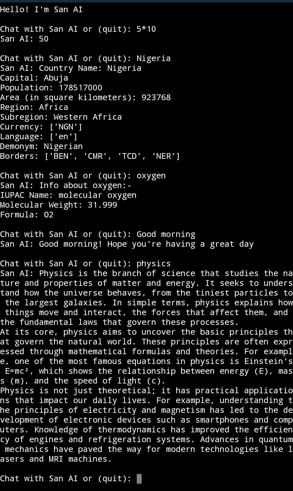

# 📱 Simple Chatbot – Python Beginner Project

A console-based Chatbot built in Python. Perfect for learning dictionaries, functions, user input, basic program flow, and big data handling.

## ✨ Features
- Interactive section with San AI
- Solve simple Mathematics
- Get information about a country by simply enter the name of the country 
- Get information about chemical elements 
- Simple menu interface

## 🚀 Quick Start

Clone the repo (or just download the ZIP if you prefer):
bash
git clone https://github.com/Emusan-01/Simple-Chatbot.git
cd Python-simple-chatbot

# Run it!
python chatbot.py

## 🛠️ What I Learned Building This
- Using **dictionaries** to store large data
- Creating **functions** for each operation (country name, chemical name e.t.c)
- Handling user input with loops and validation
- Building a simple menu-driven console app
- Fetching the store data that correspondent to the user input

**Note:** This is a simple Chatbot it can't solve advanced mathematics and you need internet before the chemical name can work.

## 📸 Demo

